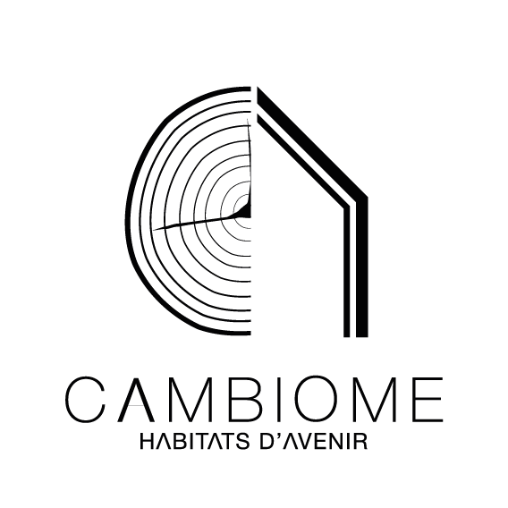
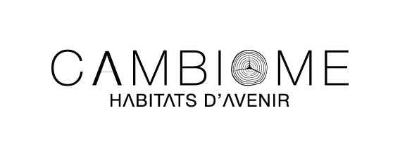
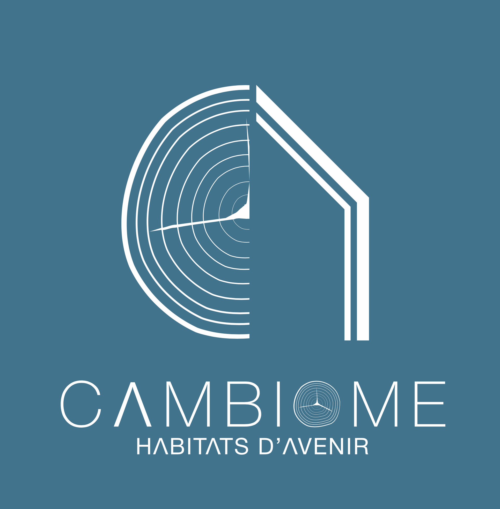
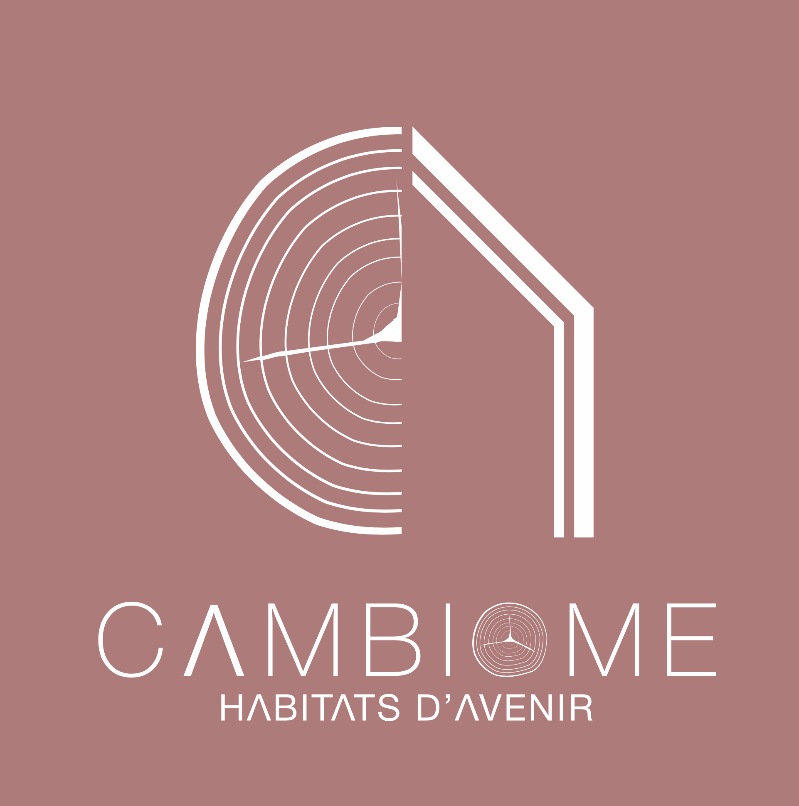
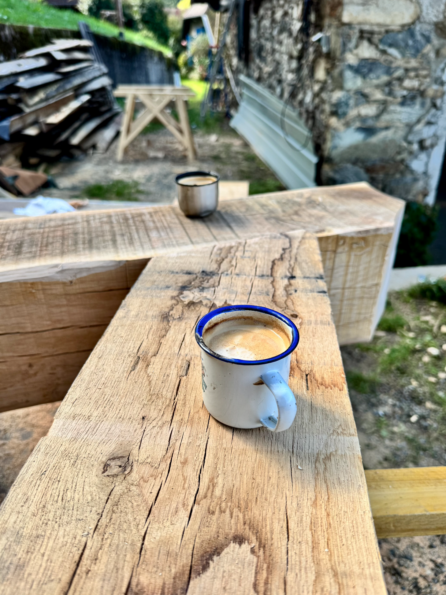
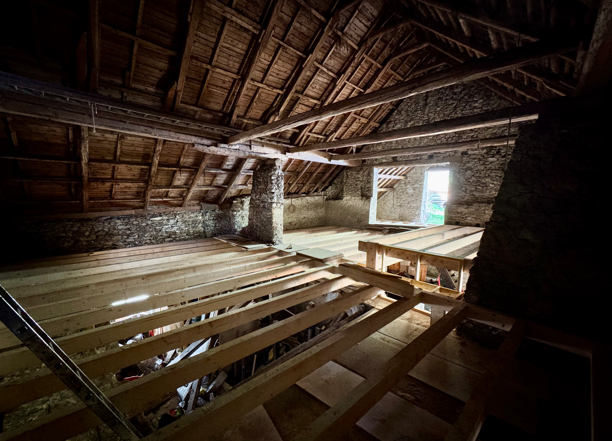
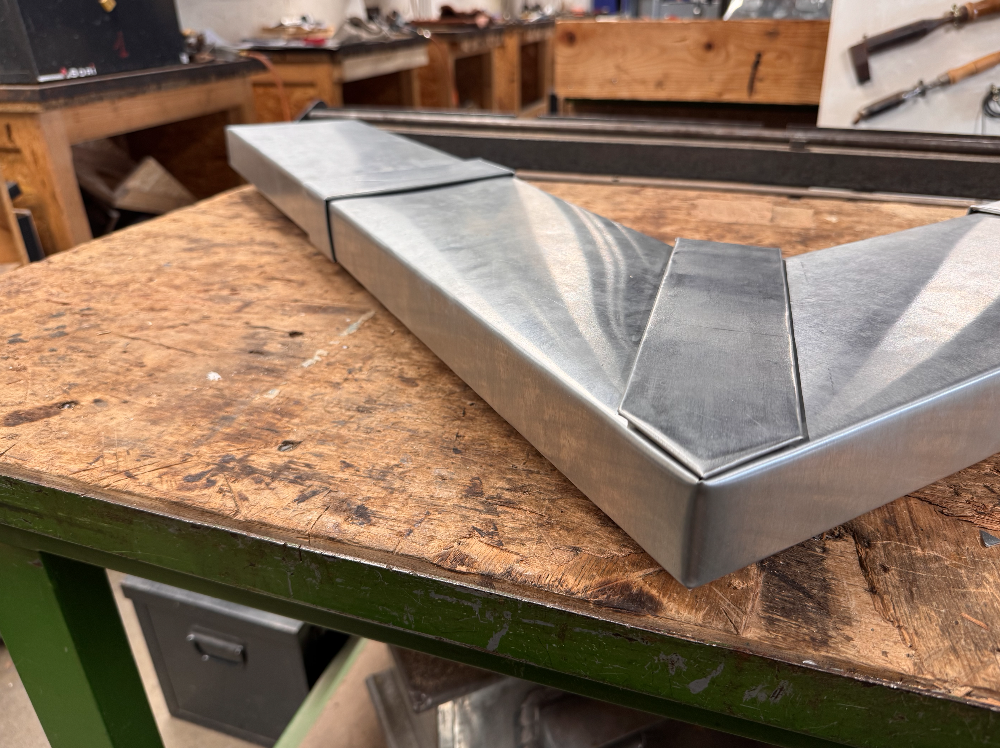
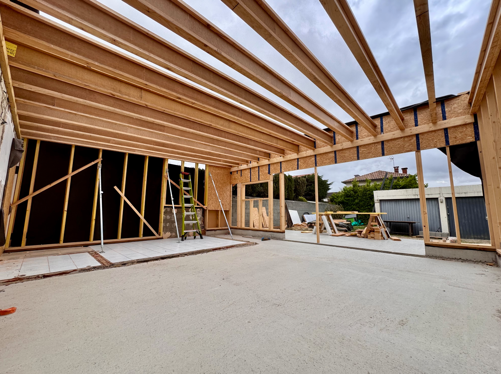
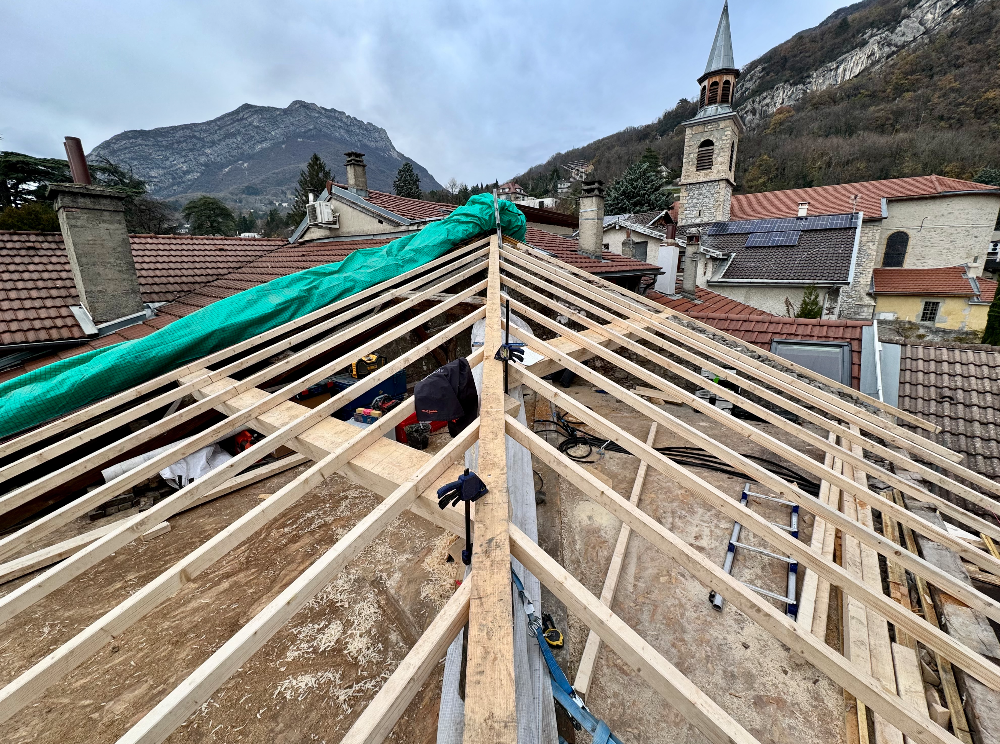
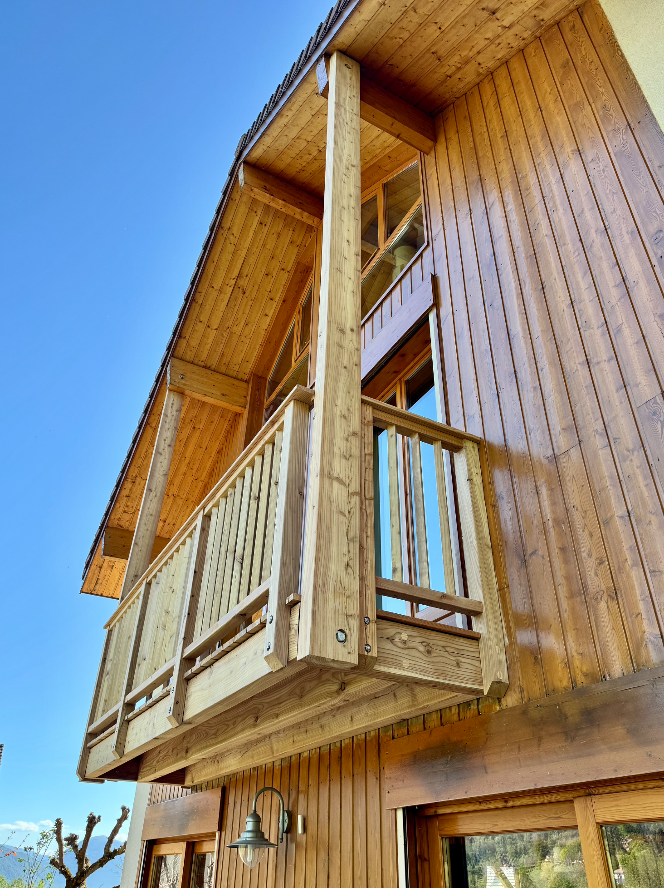

# Mémo site web CAMBIOME  
  
Site-web est souhaité comme ressemblant à celui d’écosystème ou la Raboterie sur Grenoble.  
  
Descriptif de l’entreprise :  
  
CAMBIOME est une entreprise spécialisée dans l’éco-construction. Elle réalise des travaux de charpente, couverture, zinguerie et de rénovation thermique.  
  
Notre démarche : isolation bio-sourcée et dense pour confort d’été, ventilation double flux, maîtrise de l’étanchéité à l’air du bâtiment. Ventilation des paroies de l’enveloppe du bâtiment.   
  
Nos réalisations par métiers :  
  
++Charpente et ossature bois++  
En étroite collaboration avec un bureau d’étude nous réalisons vos projets de réanimation et modification de charpente. Que se soit la réalisation d’extension mur ossature bois, la fabrication de lucarnes, la changement de pièces de charpente ou la création d’un bâtiment complet, nos équipes sont formées à ce type de chantier.   
  
++Rénovation thermique++  
L’utilisation environnemental forte épaisseur et densité de matériaux bio-sourcés à faible impact environnemental, l’amélioration des performances de fenêtres, la bonne mise en œuvre de l’étanchéité à l’air, la mise en place de protections solaire, la ventilation des parois extérieures, la mise en place de ventilation double flux. Autant d’aspects essentiels pour améliorer le confort du bâti existant et diminuer nos consommations d’énergie. Nous pouvons aussi vous proposer un accompagnement à l’auto rénovation.   
  
++Couverture et zinguerie++  
Une grande partie de l’activité de CAMBIOME consiste en la rénovation des toitures des bâtis  anciens. Une attention particulière est donnée à la finition des sous-faces en lambris et aux travaux de zinguerie.   
  
++Structure bois et menuiserie++  
Notre entreprise propose la réalisation de mobilier et structure bois en tout genre. Nous apprécierons de relever le defi de vos envies ! Terrasse avec bois local, escalier, cuisine, persiennes, bardage clair-voie et autre claustra !  
  
  
Logo png  
  
  
  
  
Titre horizontal png  
  
  
  
Autres logo couleur png  
  
  
  
  
Photos  
  
  
  
  
  
  
  
